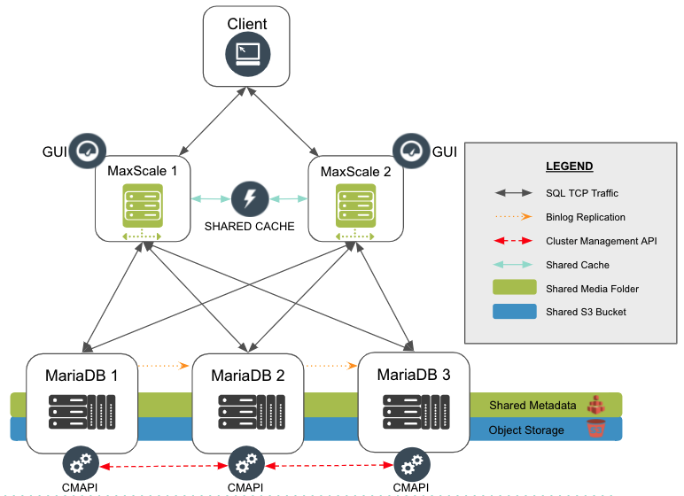

### MariaDB Enterprise 10.5.9 / ColumnStore 5.5.2 Cluster / CMAPI 1.3

#### About:

This is a [Terraform](https://www.terraform.io/) and [Ansible](https://www.ansible.com/) project to provision a **high availability** [MariaDB ColumnStore](https://mariadb.com/docs/features/mariadb-enterprise-columnstore/#mariadb-enterprise-columnstore) deployment on [Amazon Web Services](https://aws.amazon.com/). This automation project will create the following system:

*   3 **MariaDB** Nodes For Durability & Performance
*   1 **GFS2** [Multi-Attach](https://aws.amazon.com/blogs/storage/clustered-storage-simplified-gfs2-on-amazon-ebs-multi-attach-enabled-volumes/) **io1** EBS Volume (Metadata)
*   1 **S3** Bucket For Object Storage (Data)
*   2 **MaxScale** Nodes For High Availability
*   1 **Elasticache** Instance For Query Performance (Redis)

#### Prerequisites:

*   [Amazon Web Services (AWS) Account](https://aws.amazon.com/)
*   [Install Terraform](https://www.terraform.io) *<sup>†</sup>*
*   [Install Ansible](https://docs.ansible.com/ansible/latest/installation_guide/intro_installation.html#installing-ansible-with-pip) *<sup>‡</sup>*
*   [MariaDB Enterprise Token](https://customers.mariadb.com/downloads/token/)

*<sup>†</sup> Requires Terraform v0.14.4 or above.*  
*<sup>‡</sup> Requires Ansible 2.10.5 or above.*

#### Instructions:

Open a terminal window and clone the repository:

1.  `git clone https://github.com/mariadb-corporation/columnstore-ansible.git`
2.  `cd` into the newly cloned folder
3.  Edit [variables.tf](variables.tf) and supply your own variables.
4.  `terraform init`
5.  `terraform plan` (Optional)
6.  `terraform apply --auto-approve`
7.  `ansible-playbook provision.yml`

Further information can be found on our [official deployment guide](https://mariadb.com/docs/deploy/enterprise-multi-columnstore/).

##### Current Approved AWS Image(s)
AMI OS|AMI ID|Region|Zone|
---|---|---|---|
centos7|ami-0a4497cbe959da512|us-west-2|us-west-2a|

#### Cluster Manipulation Tools

*   `core`  Change directory to /var/log/mariadb/columnstore/corefiles
*   `dbrm` Change directory to /var/lib/columnstore/data1/systemFiles/dbrm
*   `extentSave` Backup extent map
*   `mcsModule` View current module name
*   `mcsStart` Start cluster via CMAPI
*   `mcsStatus` Get cluster status via CMAPI
*   `mcsShutdown` Shutdown cluster via CMAPI
*   `tcrit` Tail crit.log
*   `tdebug` Tail debug.log
*   `terror` Tail error.log
*   `tinfo` Tail info.log
*   `twarning` Tail warning.log

#### REST-API Instructions

##### Format of url endpoints for REST API:

```perl
https://{server}:{port}/cmapi/{version}/{route}/{command}
```

##### Examples urls for available endpoints:

*   `https://127.0.0.1:8640/cmapi/0.4.0/cluster/status`
*   `https://127.0.0.1:8640/cmapi/0.4.0/cluster/start`
*   `https://127.0.0.1:8640/cmapi/0.4.0/cluster/shutdown`
*   `https://127.0.0.1:8640/cmapi/0.4.0/cluster/add-node`
*   `https://127.0.0.1:8640/cmapi/0.4.0/cluster/remove-node`

##### Request Headers Needed:

*   'x-api-key': 'somekey123'
*   'Content-Type': 'application/json'

*Note: x-api-key can be set to any value of your choice during the first call to the server. Subsequent connections will require this same key*

##### Examples using curl:

###### Get Status:
```
curl -s https://127.0.0.1:8640/cmapi/0.4.0/cluster/status --header 'Content-Type:application/json' --header 'x-api-key:somekey123' -k | jq .
```
###### Start Cluster:
```
curl -s -X PUT https://127.0.0.1:8640/cmapi/0.4.0/cluster/start --header 'Content-Type:application/json' --header 'x-api-key:somekey123' --data '{"timeout":20}' -k | jq .
```
###### Stop Cluster:
```
curl -s -X PUT https://127.0.0.1:8640/cmapi/0.4.0/cluster/shutdown --header 'Content-Type:application/json' --header 'x-api-key:somekey123' --data '{"timeout":20}' -k | jq .
```
###### Add Node:
```
curl -s -X PUT https://127.0.0.1:8640/cmapi/0.4.0/cluster/add-node --header 'Content-Type:application/json' --header 'x-api-key:somekey123' --data '{"timeout":20, "node": "<replace_with_desired_hostname>"}' -k | jq .
```
###### Remove Node:
```
curl -s -X PUT https://127.0.0.1:8640/cmapi/0.4.0/cluster/remove-node --header 'Content-Type:application/json' --header 'x-api-key:somekey123' --data '{"timeout":20, "node": "<replace_with_desired_hostname>"}' -k | jq .
```

###### Mode Set:
```
curl -s -X PUT https://127.0.0.1:8640/cmapi/0.4.0/cluster/mode-set --header 'Content-Type:application/json' --header 'x-api-key:somekey123' --data '{"timeout":20, "mode": "readwrite"}' -k | jq .
```

#### MaxScale GUI Info

*   url: `http://<MaxScale_Public_IPv4_DNS>:8989`
*   username: `admin`
*   password: `mariadb`


#### Clean Up

*   `terraform destroy --auto-approve`

#### Special Notes

Complete cluster shutdown (Power Off) sequence with [GFS2](https://aws.amazon.com/blogs/storage/clustered-storage-simplified-gfs2-on-amazon-ebs-multi-attach-enabled-volumes/) HA:

1.  `[root@mcs1 /]# mcsShutdown`
1.  `[root@mcs1 /]# pcs cluster stop --all`
1.  `[root@mcs3 /]# shutdown -h now`
1.  `[root@mcs2 /]# shutdown -h now`
1.  `[root@mcs1 /]# shutdown -h now`

Complete cluster bootstrap (Power On) sequence with [GFS2](https://aws.amazon.com/blogs/storage/clustered-storage-simplified-gfs2-on-amazon-ebs-multi-attach-enabled-volumes/) HA:

1.  From [Amazon Console](console.aws.amazon.com):
    1. **EC2 Dashboard** > **Instances** > *mcs1* > **Instance state** > **Start instance**
    1. **EC2 Dashboard** > **Instances** > *mcs2* > **Instance state** > **Start instance**
    1. **EC2 Dashboard** > **Instances** > *mcs3* > **Instance state** > **Start instance**
    1. **Note:** *Public IPv4 DNS may have changed. Verify on the Networking tab.*
1.  `[root@mcs1 /]# pcs cluster start --all`
1.  *Wait 30 seconds for the [pcs cluster](includes/sharing.yml) to start*
1.  `[root@mcs1 /]# mcsStart`
